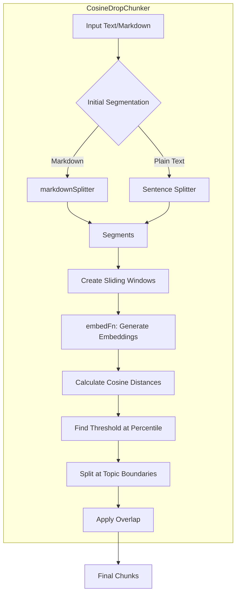

# CosineDropChunker Developer Guide

This guide covers the advanced text and markdown chunking capabilities provided by the `CosineDropChunker` and `markdownSplitter`. This system is designed to intelligently split content based on semantic meaning rather than fixed sizes, leading to more coherent and contextually relevant chunks.

This is ideal for preparing data for Retrieval-Augmented Generation (RAG) systems, where contextually rich chunks lead to better search results and more accurate LLM responses.

## Semantic Splitting Logic Visual Flow



## Core Concepts

- **Semantic Chunking**: Traditional chunking splits text by character count, which can awkwardly break sentences or separate related ideas. Semantic chunking analyzes the topics within the text and splits it at points where the topic changes.
- **`CosineDropChunker`**: This is the core component. It works by generating vector embeddings for small, sliding windows of text. It then calculates the cosine similarity between adjacent windows. A sharp "drop" in similarity (a high cosine distance) indicates a change in topic, which becomes a natural boundary for a new chunk.
- **`markdownSplitter`**: A powerful preprocessor for the chunker. Instead of treating markdown as plain text, it parses the document's structure (headings, lists, code blocks, tables) and creates initial segments that respect this structure. This ensures that related markdown elements stay together.

---

## `markdownSplitter`

This utility function parses a markdown string and splits it into logical segments based on its syntax.

### Usage

```typescript
import { markdownSplitter } from '@jasonnathan/llm-core';
import fs from 'fs/promises';

async function main() {
  const markdownContent = await fs.readFile('my-doc.md', 'utf-8');
  
  // Basic splitting
  const segments = markdownSplitter(markdownContent);

  // Group content under headings
  const headingGroups = markdownSplitter(markdownContent, { useHeadingsOnly: true });

  console.log(headingGroups);
}

main();
```

---

## `CosineDropChunker`

This is the main class for performing semantic chunking.

### Initialization

The chunker requires an `EmbedFunction` during initialization. This function is responsible for converting an array of text strings into vector embeddings. You can provide this using a service like `OllamaService` or `OpenAIService`.

```typescript
import { CosineDropChunker, OllamaService } from '@jasonnathan/llm-core';

// 1. Initialize a service that can create embeddings
const ollama = new OllamaService('mxbai-embed-large'); // Use a dedicated embedding model

// 2. Create the embedding function
const embedFn = (texts: string[]) => ollama.embedTexts(texts);

// 3. Instantiate the chunker
const chunker = new CosineDropChunker(embedFn);
```

### Chunking Markdown

This is the recommended approach for documentation or any markdown-based content. The chunker will use `markdownSplitter` internally.

```typescript
async function chunkMarkdown() {
  const markdownContent = await fs.readFile('README.md', 'utf-8');

  const chunks = await chunker.chunk(markdownContent, {
    type: 'markdown',
    breakPercentile: 95, // Split only at the most significant topic changes
    minChunkSize: 300,
    maxChunkSize: 2000,
    overlapSize: 1,      // Overlap by one sentence/segment
  });

  console.log(`Generated ${chunks.length} chunks.`);
}
```

### Chunking Plain Text

For unstructured text, the chunker will split the content by sentences as its initial segmentation strategy.

```typescript
async function chunkText() {
  const textContent = "This is the first sentence. This is the second one. A third sentence provides new context and talks about something different.";

  const chunks = await chunker.chunk(textContent, {
    type: 'text',
    breakPercentile: 90,
    bufferSize: 2, // Use a window of 2 sentences for similarity checks
  });

  console.log(chunks);
}
```

### Configuration Options (`ChunkOptions`)

- **`type`**: `'markdown' | 'text'`. Determines the initial segmentation strategy. Defaults to `'text'`.
- **`breakPercentile`**: `number` (0-100). The percentile of cosine distance to use as the split threshold. A higher value (e.g., 95) results in fewer, larger chunks, splitting only on major topic shifts. A lower value creates more, smaller chunks. Defaults to `90`.
- **`bufferSize`**: `number`. The number of initial segments (sentences or markdown blocks) to group into a sliding window for embedding. Defaults to `2`.
- **`minChunkSize`**: `number`. The minimum character length for a chunk to be kept. Defaults to `300`.
- **`maxChunkSize`**: `number`. The maximum character length for a chunk. If a chunk exceeds this, it will be split. Defaults to `2000`.
- **`overlapSize`**: `number`. The number of segments from the end of a chunk to include at the start of the next chunk to maintain context. Defaults to `1`.
- **`useHeadingsOnly`** (markdown only): `boolean`. If `true`, groups all content under the preceding heading, creating larger, more structured chunks. Defaults to `false`.
