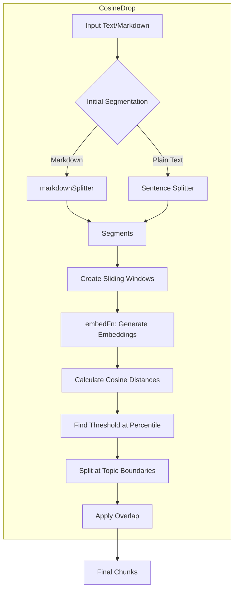

# Semantic Chunker Guide

This guide covers advanced text and markdown chunking using a pipeline-based cosine-distance strategy (`cosineDropChunker`) and the `markdownSplitter`. It splits content at natural topic boundaries, producing coherent chunks ideal for RAG systems.

This is ideal for preparing data for Retrieval-Augmented Generation (RAG) systems, where contextually rich chunks lead to better search results and more accurate LLM responses.

## Semantic Splitting Logic Visual Flow



## Core Concepts

- **Semantic Chunking**: Traditional chunking splits text by character count, which can awkwardly break sentences or separate related ideas. Semantic chunking analyzes topic changes and splits where cosine distance spikes.
- **`cosineDropChunker`**: Functional, pipeline-based chunker. Generates embeddings for sliding windows, computes cosine distances, selects a percentile threshold, and splits. Uses helpers like `withAlternatives` to fall back safely.
- **`markdownSplitter`**: Parses markdown structure (headings, lists, code blocks, tables) to create initial segments that respect document structure.

---

## `markdownSplitter`

This utility function parses a markdown string and splits it into logical segments based on its syntax.

### Usage

```typescript
import { markdownSplitter } from '@jasonnathan/llm-core';
import fs from 'fs/promises';

async function main() {
  const markdownContent = await fs.readFile('my-doc.md', 'utf-8');
  
  // Basic splitting
  const segments = markdownSplitter(markdownContent);

  // Group content under headings
  const headingGroups = markdownSplitter(markdownContent, { useHeadingsOnly: true });

  console.log(headingGroups);
}

main();
```

---

## `cosineDropChunker`

Functional chunker that requires an `EmbedFunction` inside a context object. The context lets you inject your own logger and timeouts/retries.

```typescript
import { cosineDropChunker } from '@jasonnathan/llm-core';
import { createOllamaContext, embedTexts } from '@jasonnathan/llm-core';

// 1) Build an embedding context (Ollama example)
const svc = createOllamaContext({ ollama: { model: 'all-minilm:l6-v2' } });
const embed = (texts: string[]) => embedTexts(svc, texts);

// 2) Build chunker context
const ctx = { logger: console, embed, pipeline: { retries: 0, timeout: 0 } };
```

### Chunking Markdown

This is the recommended approach for documentation or any markdown-based content. The chunker will use `markdownSplitter` internally.

```typescript
async function chunkMarkdown() {
  const markdownContent = await fs.readFile('README.md', 'utf-8');

  const chunks = await cosineDropChunker(ctx, markdownContent, {
    type: 'markdown',
    breakPercentile: 95, // Split only at the most significant topic changes
    minChunkSize: 300,
    maxChunkSize: 2000,
    overlapSize: 1,      // Overlap by one sentence/segment
  });

  console.log(`Generated ${chunks.length} chunks.`);
}
```

### Chunking Plain Text

For unstructured text, the chunker will split the content by sentences as its initial segmentation strategy.

```typescript
async function chunkText() {
  const textContent = "This is the first sentence. This is the second one. A third sentence provides new context and talks about something different.";

  const chunks = await cosineDropChunker(ctx, textContent, {
    type: 'text',
    breakPercentile: 90,
    bufferSize: 2, // Use a window of 2 sentences for similarity checks
  });

  console.log(chunks);
}
```

### Configuration Options (`ChunkOptions`)

- **`type`**: `'markdown' | 'text'`. Determines the initial segmentation strategy. Defaults to `'text'`.
- **`breakPercentile`**: `number` (0-100). The percentile of cosine distance to use as the split threshold. A higher value (e.g., 95) results in fewer, larger chunks, splitting only on major topic shifts. A lower value creates more, smaller chunks. Defaults to `90`.
- **`bufferSize`**: `number`. The number of initial segments (sentences or markdown blocks) to group into a sliding window for embedding. Defaults to `2`.
- **`minChunkSize`**: `number`. The minimum character length for a chunk to be kept. Defaults to `300`.
- **`maxChunkSize`**: `number`. The maximum character length for a chunk. If a chunk exceeds this, it will be split. Defaults to `2000`.
- **`overlapSize`**: `number`. The number of segments from the end of a chunk to include at the start of the next chunk to maintain context. Defaults to `1`.
- **`useHeadingsOnly`** (markdown only): `boolean`. If `true`, groups all content under the preceding heading, creating larger, more structured chunks. Defaults to `false`.

### Types

```ts
type EmbedFunction = (texts: string[]) => Promise<number[][]>;

type ChunkerContext = {
  logger?: { info?: (s: string) => void; warn?: (s: string) => void; error?: (e: unknown) => void };
  pipeline?: { retries?: number; timeout?: number };
  embed: EmbedFunction;
};
```
