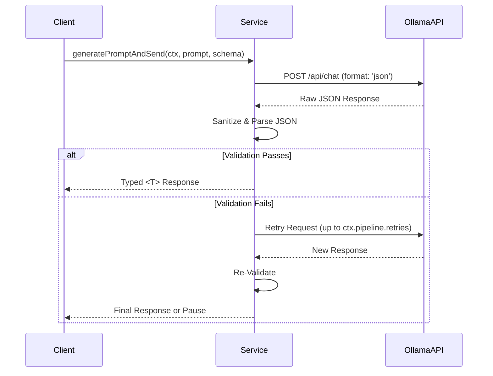

# Ollama Service (pipeline-based)

Functional, pipeline-driven helpers for interacting with the [Ollama](https://ollama.com/) API. They provide high-level primitives for generating typed JSON and creating text embeddings, with built-in retry/timeout policies and error logging, and use your app context directly.

## Typed JSON Responses via LLM Visual Flow



## Core Concepts

- **Context-first**: You pass a context with `logger`, optional `pipeline` policy slots, and model settings. The helpers use this context directly.
- **Structured Prompts**: Provide a JSON schema via `options.schema` to request structured JSON. The Service sanitizes and parses content robustly.
- **Embeddings**: Create vector embeddings for text with the same context (observing retry/timeout policies).

---

## API Reference & Usage

Initialize a context, call high‑level helpers, and handle structured results.

### Initialization

First, ensure your environment variables are set up in a `.env` file. The service will automatically pick them up.

```env
OLLAMA_ENDPOINT="http://localhost:11434"
# OLLAMA_API_KEY="your-api-key" # Optional
```

Create a context with model and endpoint info (env defaults are supported):

```typescript
import { createOllamaContext } from '@jasonnathan/llm-core';

const ctx = createOllamaContext({
  ollama: { model: 'llama3:8b-instruct-q8_0' },
  pipeline: { retries: 2, timeout: 12_000 },
  // logger?: your ILogger
});
```

### `generatePromptAndSend<T>()`

This is the primary method for sending a request to the Ollama chat API and receiving a structured JSON response.

- **`T`**: A generic type parameter representing the expected shape of the JSON response.
- **`systemPrompt`**: A string defining the LLM's role and instructions.
- **`userPrompt`**: A string containing the user's query or the content to be processed.
- **`options`**: An object that can contain a `schema` to enforce JSON output.
- **`customCheck`** (optional): A function `(response: T) => T | boolean` to validate the parsed response. If it returns `false`, the request will be retried.

#### Example: Generating a Structured Response

This example asks for a specific JSON object and has the Service parse and type-check it.

```typescript
import { createOllamaContext, generatePromptAndSend } from '@jasonnathan/llm-core';

interface UserProfile {
  name: string;
  email: string;
  age: number;
}

const ctx = createOllamaContext({ ollama: { model: 'llama3:8b-instruct-q8_0' } });

async function main() {
  const systemPrompt = "You are a data extraction expert. Generate a JSON object from the user's text.";
  const userPrompt = "Create a profile for John Doe. His email is john.doe@example.com and he is 30 years old.";

  const options = {
    schema: {
      type: "object",
      properties: {
        name: { type: "string" },
        email: { type: "string" },
        age: { type: "number" },
      },
      required: ["name", "email", "age"],
    },
  };

  try {
    const profile = await generatePromptAndSend<UserProfile>(
      ctx,
      systemPrompt,
      userPrompt,
      options
    );

    console.log(profile);
    // Expected Output:
    // {
    //   name: "John Doe",
    //   email: "john.doe@example.com",
    //   age: 30
    // }
  } catch (error) {
    console.error("Failed to generate profile:", error);
  }
}

main();
```

### `embedTexts()`

This function generates vector embeddings for an array of text inputs using your context.

- **`inputs`**: An array of strings to be embedded.

#### Example: Creating Embeddings

```typescript
import { createOllamaContext, embedTexts } from '@jasonnathan/llm-core';

// Use a model specifically trained for embeddings
const ctx = createOllamaContext({ ollama: { model: 'all-minilm:l6-v2' } });

async function main() {
  const texts = [
    "This is the first sentence.",
    "This is the second one.",
  ];

  try {
    const embeddings = await embedTexts(ctx, texts);
    console.log("Generated embeddings:", embeddings.length); // Output: 2
    console.log("Dimension:", embeddings[0].length);
  } catch (error) {
    console.error("Failed to generate embeddings:", error);
  }
}

main();
```

### Advanced Usage: Custom Validation

You can provide a `customCheck` function to add your own validation logic to the response. If the check fails, the Service does not accept the response and, depending on your `ctx.pipeline.retries`, may retry.

```typescript
const customCheck = (response: UserProfile): UserProfile | boolean => {
  // Only accept profiles for users older than 18.
  if (response.age > 18) {
    return response; // Return the valid response
  }
  return false; // Trigger a retry
};

const profile = await generatePromptAndSend<UserProfile>(
  ctx,
  systemPrompt,
  userPrompt,
  options,
  customCheck
);
```

### Error Handling & Policies

The Service applies `withErrorHandling`, `withTimeout`, and `withRetry` within a pipeline. Network or parsing issues are logged via your `logger`; pauses (like timeouts) short‑circuit gracefully. Tune `ctx.pipeline.retries` and `ctx.pipeline.timeout` per run.
