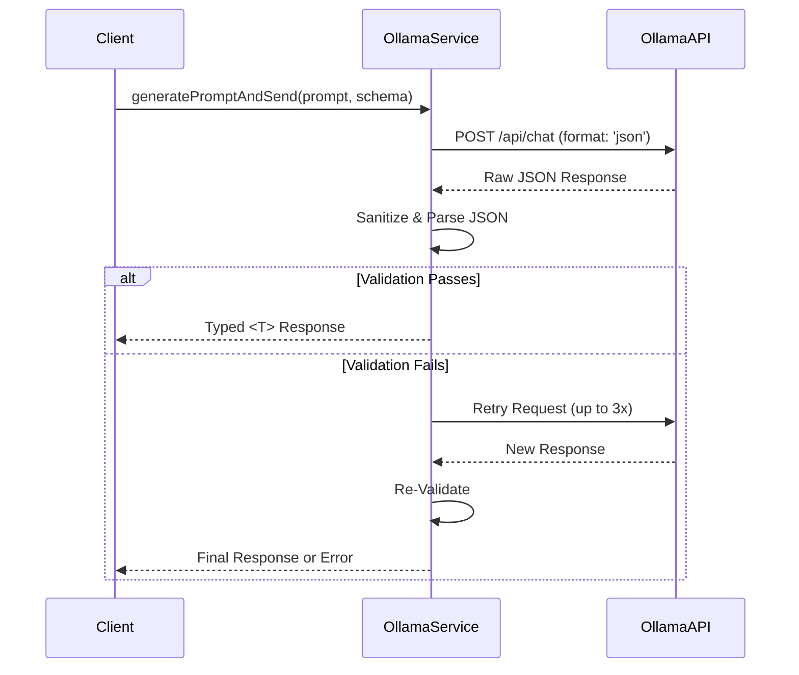

# OllamaService Developer Guide

The `OllamaService` is a robust client for interacting with the [Ollama](https://ollama.com/) API. It provides a high-level interface for generating text, enforcing structured JSON output, and creating text embeddings, with built-in retry logic and error handling.

It is designed to be used with models that support JSON output and instruction following.

<details>
<summary>Typed JSON Responses via LLM Visual Flow</summary>



</details>

## Core Concepts

- **Service Client**: A class-based client that manages the connection and authentication with the Ollama API.
- **Structured Prompts**: A key feature is the ability to request structured JSON output from the LLM by providing a JSON schema in the prompt options. The service handles the sanitization and parsing of the response to ensure it conforms to the requested type.
- **Embeddings**: The service can also be used to generate vector embeddings for text, which is essential for tasks like semantic search and clustering.

---

## API Reference & Usage

### Initialization

First, ensure your environment variables are set up in a `.env` file. The service will automatically pick them up.

```env
OLLAMA_ENDPOINT="http://localhost:11434"
# OLLAMA_API_KEY="your-api-key" # Optional
```

Then, instantiate the service with the desired model name.

```typescript
import { OllamaService } from '@jasonnathan/llm-core';

// The model name is required. Endpoint and API key are read from .env by default.
const ollama = new OllamaService('llama3:8b-instruct-q8_0');
```

### `generatePromptAndSend<T>()`

This is the primary method for sending a request to the Ollama chat API and receiving a structured JSON response.

- **`T`**: A generic type parameter representing the expected shape of the JSON response.
- **`systemPrompt`**: A string defining the LLM's role and instructions.
- **`userPrompt`**: A string containing the user's query or the content to be processed.
- **`options`**: An object that can contain a `schema` to enforce JSON output.
- **`customCheck`** (optional): A function `(response: T) => T | boolean` to validate the parsed response. If it returns `false`, the request will be retried.

#### Example: Generating a Structured Response

This example shows how to ask for a specific JSON object and have the service parse and type-check it.

```typescript
import { OllamaService } from '@jasonnathan/llm-core';

interface UserProfile {
  name: string;
  email: string;
  age: number;
}

const ollama = new OllamaService('llama3:8b-instruct-q8_0');

async function main() {
  const systemPrompt = "You are a data extraction expert. Generate a JSON object from the user's text.";
  const userPrompt = "Create a profile for John Doe. His email is john.doe@example.com and he is 30 years old.";

  const options = {
    schema: {
      type: "object",
      properties: {
        name: { type: "string" },
        email: { type: "string" },
        age: { type: "number" },
      },
      required: ["name", "email", "age"],
    },
  };

  try {
    const profile = await ollama.generatePromptAndSend<UserProfile>(
      systemPrompt,
      userPrompt,
      options
    );

    console.log(profile);
    // Expected Output:
    // {
    //   name: "John Doe",
    //   email: "john.doe@example.com",
    //   age: 30
    // }
  } catch (error) {
    console.error("Failed to generate profile:", error);
  }
}

main();
```

### `embedTexts()`

This method generates vector embeddings for an array of text inputs.

- **`inputs`**: An array of strings to be embedded.

#### Example: Creating Embeddings

```typescript
import { OllamaService } from '@jasonnathan/llm-core';

// Use a model specifically trained for embeddings
const ollama = new OllamaService('all-minilm:l6-v2');

async function main() {
  const texts = [
    "This is the first sentence.",
    "This is the second one.",
  ];

  try {
    const embeddings = await ollama.embedTexts(texts);
    console.log("Generated embeddings:", embeddings.length); // Output: 2
    console.log("Dimension:", embeddings[0].length);
  } catch (error) {
    console.error("Failed to generate embeddings:", error);
  }
}

main();
```

### Advanced Usage: Custom Validation

You can provide a `customCheck` function to add your own validation logic to the response. If the check fails, the service will automatically retry the request up to 3 times.

```typescript
const customCheck = (response: UserProfile): UserProfile | boolean => {
  // Only accept profiles for users older than 18.
  if (response.age > 18) {
    return response; // Return the valid response
  }
  return false; // Trigger a retry
};

const profile = await ollama.generatePromptAndSend<UserProfile>(
  systemPrompt,
  userPrompt,
  options,
  customCheck
);
```

### Error Handling

The `OllamaService` is designed to be resilient. It will retry failed network requests up to 3 times before throwing an error. Errors can occur due to network issues, invalid API responses, or failed custom checks. Always wrap your calls in a `try...catch` block to handle potential failures.
