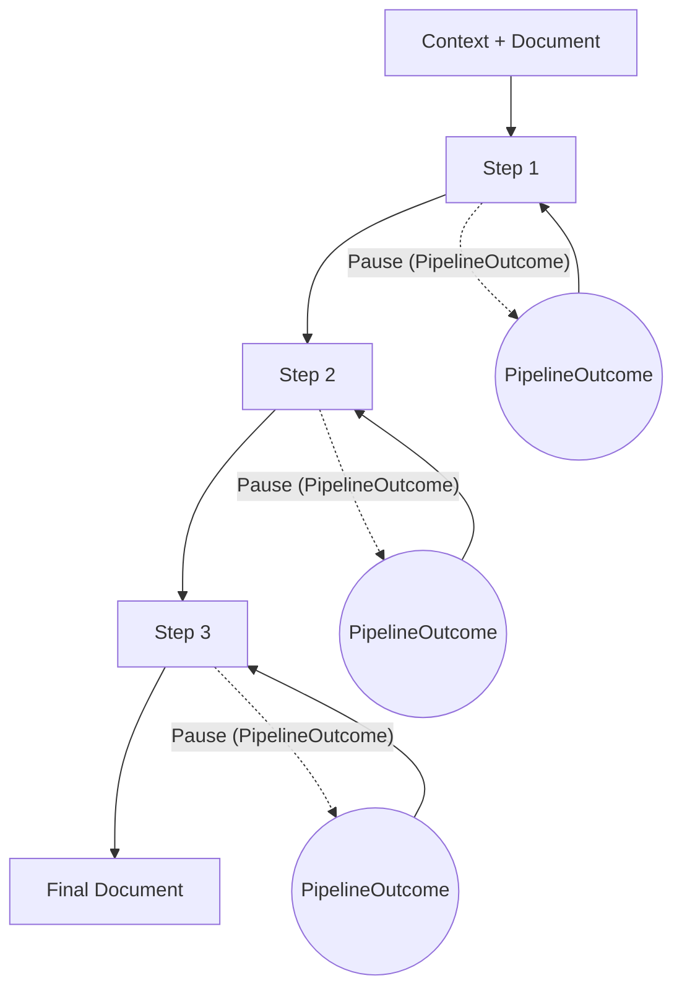

## Pipeline Module: Context‑Based Design

The Pipeline module provides a lightweight way to orchestrate data‑processing workflows. A pipeline is simply a series of functions (**steps**) that each take a document and a shared **context**, transform the document, and optionally signal that execution should pause. This context‑based design lets you carry loggers, counters, caches or other shared state through every step without hard‑coding dependencies.

## Visual Flow

The diagram below illustrates the pipeline model. A document enters the pipeline with its context and flows through each step in order. At any step the pipeline may _yield_ a pause outcome (for example, waiting for human input or a rate‑limit timeout). The caller can inspect the pause, act on it and then resume processing from the same point.



Each dashed arrow represents a `PipelineOutcome<T>` returned by a step with `done: false`. The pipeline suspends execution at that point. When you resume (via `next()`), the pipeline picks up exactly where it left off.

## Defining Steps

A step is a curried function taking your context and returning a transformation function on the document:

```ts
type PipelineStep<I, O, C = unknown> = (
  ctx: C
) => (doc: I) => O | PipelineOutcome<O> | Promise<O | PipelineOutcome<O>>;
```

Steps may synchronously or asynchronously transform the document. To pause execution, return `{ done: false, reason: string, payload: any }`. When the pipeline encounters such a result it yields control to the caller.

### Example Steps

```ts
interface MsgCtx {
  logger: Console;
}
interface Message {
  text: string;
  approved?: boolean;
}

// Trim whitespace
const trim: PipelineStep<Message, Message, MsgCtx> = (ctx) => (doc) => {
  ctx.logger.info("Trimming text...");
  return { ...doc, text: doc.text.trim() };
};

// Require approval
const requireApproval: PipelineStep<Message, Message> = () => (doc) => {
  if (!doc.approved) {
    return {
      done: false,
      reason: "approval",
      payload: doc,
    } as PipelineOutcome<Message>;
  }
  return doc;
};
```

## Creating Pipelines

Use `pipeline<C, T>(context)` to create a new pipeline. Chain `.addStep()` to add steps. Then either `.run(doc)` to process the entire pipeline, `.stream(doc)` to iterate through each yield, or `.next(doc, resume)` for fine‑grained control.

```ts
const ctx: MsgCtx = { logger: console };
const p = pipeline<MsgCtx, Message>(ctx).addStep(trim).addStep(requireApproval);

// Run end‑to‑end
p.run({ text: " hello " }).then((final) => console.log(final));

// Stream and handle pauses (event-based)
for await (const evt of p.stream({ text: " hello " })) {
  if (evt.type === "progress") {
    ctx.logger.info(`progress at step #${evt.step + 1}`);
  }
  if (evt.type === "pause") {
    ctx.logger.warn(`paused at step #${evt.step + 1}: ${evt.info.reason}`);
    // Optionally resume immediately
    await p.next(evt.resume.doc, evt.resume);
  }
}
```

## API Reference & Usage

### Core Types

#### Context

You can pass any context object to `pipeline(ctx)`. Steps receive it as `unknown`; cast to your app shape as needed. Helpers read optional fields under `ctx.pipeline` (e.g. `retries`, `timeout`, `cache`, `stopCondition`).

#### `PipelineOutcome<T>`

Signal a pause or early “done” from within a step:

```ts
export type PipelineOutcome<T> =
  | { done: false; reason: string; payload: T }  // pause, with a reason & document
  | { done: true;  value: T };                  // an early “done” that still produces a new doc
```

#### `PipelineStep<I, O, C = unknown>`

Curried transformer over documents: given a context, returns a function that transforms `I` into `O`, or yields a `PipelineOutcome<O>`.

```ts
export type PipelineStep<I, O, C = unknown> =
  (ctx: C) =>
    (doc: I) =>
      O
      | PipelineOutcome<O>
      | Promise<O | PipelineOutcome<O>>;
```

---

### Pipeline Factory

#### `pipeline<C, T>(ctx: C): Pipeline<C, T>`

Create a new pipeline bound to your context:

```ts
const myCtx = {
  logger: console,
  pipeline: {},
  state: { history: [] },
};

const p = pipeline(myCtx);
```

#### `addStep(step: PipelineStep<T, N, C>) → Pipeline<C, T, N>`

Append a single step to the pipeline’s sequence:

```ts
p.addStep(trimStep)
 .addStep(validateStep)
 .addStep(transformStep);
```

#### `run(doc: T) → Promise<O>`

Execute every step in order and resolve with the final document.
If any step returns a **pause** outcome (`done: false`), `run()` resolves immediately with the last document state.

```ts
const finalDoc = await p.run(initialDoc);
```

#### `stream(doc: T, resume?: ResumeState<T>) → AsyncGenerator<StreamEvent<O>, O, void>`

Iterate step‑by‑step, yielding after **every** step:

* **`type: 'progress'`** → a normal document
* **`type: 'pause'`**    → a pause outcome `{ done:false,… }`
* **`type: 'done'`**     → pipeline finished

Use this for human‑in‑the‑loop, back‑pressure or progress reporting:

```ts
for await (const evt of p.stream(initialDoc)) {
  if (evt.type === "pause") {
    // handle evt.info, then resume…
  } else if (evt.type === "progress") {
    console.log(evt.doc);
  }
}
```

#### `next(doc: T, resume?: ResumeState<T>) → Promise<StreamEvent<O> | {done:true;value:O}>`

Advance the pipeline exactly one step (or resume from a pause) without managing the generator yourself.

---

### Streaming Types

```ts
export type ResumeState<T> = { nextStep: number; doc: T };

export type StreamEvent<T> =
  | { type: 'progress'; step: number; doc: T; resume: ResumeState<T> }
  | { type: 'pause';    step: number; doc: T; info: Extract<PipelineOutcome<T>, { done: false }>; resume: ResumeState<T> }
  | { type: 'done' };
```

### Helpers

A suite of ready‑made wrappers lives in **`src/core/helpers.ts`** (see `PIPELINE_HELPERS.md`):

- Step wrappers: `withErrorHandling`, `withRetry`, `withTimeout`, `withCache`, `tap`, `withMultiStrategy`
- Transformer composition: `pipe`, `compose` (work on `(ctx, doc) -> [ctx, doc | PipelineOutcome]`)
- Integrations: `eventsFromPipeline`, `pipelineToTransform`

---

### Integrations

* **EventEmitter**:  `eventsFromPipeline(pipeline, initial)` → emits `progress`, `pause`, `done`, `error` with resume tokens
* **Node Streams**:  `pipelineToTransform(pipeline, onPause?)` → processes objects, pushes NDJSON; on pause calls handler and stops current chunk

For detailed examples of rate‑limiting, human‑in‑the‑loop, backpressure, progress reporting, and more, see the companion [`PIPELINE_HELPERS.md`](./PIPELINE_HELPERS.md) and the `examples/` directory.

---

### TL;DR

- Compose with `pipeline<Ctx, Initial>(ctx).addStep(...).addStep(...).addStep(...)`.
- `run(initial)` returns final output; if a step pauses, it resolves early with the last completed doc.
- `stream(initial, [resume])` yields `{progress|pause|done}` and provides a resume token.
- `next(initial, [resume])` advances one step at a time (good for UI/CLIs).

#### Multi‑strategy

To try multiple sub‑strategies in order with optional early stop, use the helper:

```ts
import { withMultiStrategy } from "@jasonnathan/llm-core";

const multi = withMultiStrategy([
  stepA,
  stepB,
  stepC,
]);

const p = pipeline(ctx).addStep(multi);
```
