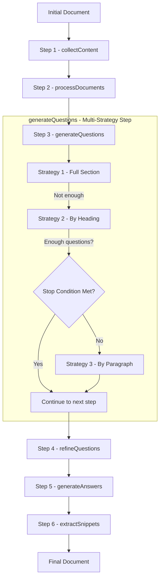
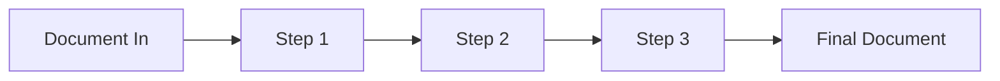
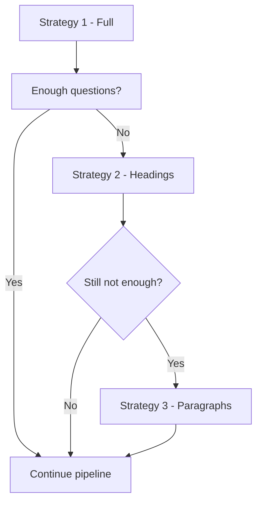
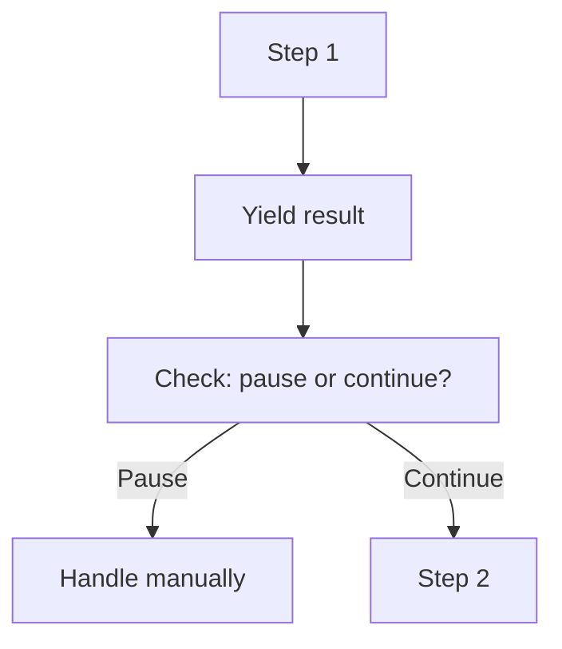

# Pipeline Module Developer Guide

The Pipeline module provides a powerful and flexible way to orchestrate complex, multi-step data processing workflows. It allows you to define a sequence of operations as independent, reusable "steps" and then execute them in order on a given data object, or "document".

This is particularly useful for tasks that involve multiple transformations, external API calls (like to an LLM), and conditional logic.

## Step-by-Step Data Transformation Visual Flow


---

## How Pipelines Work
*A conceptual walkthrough of transformation, composition, and control flow.*

A pipeline is a sequence of steps (kinda like a conveyor belt for data.)

You pass in a document, and each step modifies or enriches it before handing it off to the next. The pipeline ensures each step runs in order, logs its progress, and gracefully handles interruptions or failures.

Here’s the mental model:



### Step Anatomy

A pipeline step can be just about anything.

It doesn’t care if you’re synchronous, asynchronous, composed, nested, recursive, tapped, (or just vibing). If it fits the shape, it’s a step.

```ts
type PipelineStep<T> =
  (logger: ILogger) => (doc: T) => T | PipelineOutcome<T> | Promise<T | PipelineOutcome<T>>;
```

Now, that is deceptively complex, but all it really means is that you’re not required to `async` it, or to `Promise.resolve()` it.
You just need to return either a **new or modified document (`T`)**, or a `PipelineOutcome<T>` that says *“pause here, something needs attention”*.

#### Basic Step

The simplest step can be a function that does something useful and moves on:

```ts
const normaliseText: PipelineStep<MyDoc> = (logger) => (doc) => {
  logger.info("Normalising text...");
  return { ...doc, text: doc.text.trim() };
};
```

#### Human-In-The-Loop Pause

Sometimes a step needs to halt the pipeline — maybe for review, approval, or external input.

```ts
const needsApproval: PipelineStep<MyDoc> = (logger) => (doc) => {
  if (!doc.approved) {
    return {
      done: false,
      reason: "Awaiting human approval",
      payload: doc,
    };
  }

  return doc;
};
```

You can handle this pause in `.stream()` (more on that later) and resume when ready.

#### Tap-Style Side Effect

Want to inspect or log without changing anything? Tap it:

```ts
const tapStep: PipelineStep<MyDoc> = (logger) => (doc) => {
  logger.info("Tapping:", doc.id);
  return doc;
};
```

It's pretty much `Array.prototype.tap`, just pipeline-native.

#### Composite Step (Nested Pipeline)

Steps can compose other pipelines too, since a step is pretty much anything.

```ts
const enrichViaSubPipeline: PipelineStep<MyDoc> = (logger) => async (doc) => {
  const subPipeline = pipeline<MyDoc>(logger)
    .addStep(enrichFromMetadata)
    .addStep(runLLMInference);

  return await subPipeline.run(doc);
};
```

Nothing breaks here, it’s pipelines all the way down.

#### Sync Functions Work Too

Even though `run()` and `stream()` uses `await`, your step doesn't need to:

```ts
const markAsProcessed: PipelineStep<MyDoc> = (logger) => (doc) => {
  return { ...doc, processed: true };
};
```

The pipeline will `await` it anyway — so sync steps are 100% valid and encouraged where appropriate.
**Because not everything needs to be a Promise.**

#### TL;DR

> If you can return a doc, or a reason to pause, you’re a step.

The rest is really just ceremony. Steps are minimal, composable, and anarchic - just the way we like them.

#### Multi-Strategy Steps: Try → Fallback → Bail

Some steps are actually *composed of multiple internal strategies* and we can do that with `addMultiStrategyStep`
For example, to generate questions from a document, we might try:

1. The full document
2. Headings
3. Paragraphs

Each strategy attempts to meet a condition (like generating enough questions). If one succeeds, we short-circuit and skip the rest.



As code, that looks like: 
```ts
pipeline<MyDoc>(logger)
  .addMultiStrategyStep(
    [
      tryFullSection(...),
      tryByHeading(...),
      tryByParagraph(...),
    ],
    (doc) => doc.questions.length >= 10 // stopCondition
  );
```
If none of the strategies meet the condition, the result is the **accumulated output** from all attempts.

And that’s precisely what `addMultiStrategyStep` enables:

> Multiple sub-steps bundled as one logical step, with optional early exit.

Put another way:

> Interrogate LLMs until they conform.

### Streaming vs Running

The pipeline can run end-to-end automatically, or you can stream one step at a time if you need control.

1. `.run(doc)`: Fire-and-forget. Steps execute one after the other. Ideal for background jobs and automation.
2. `.stream(doc)`: Processes one step at a time, here's where you can inject pauses or other interruptions

For example, if you have a live UI and you need human interaction, or if you are polling and waiting for data (*hello OpenAI Batch API*)

What it looks like in action:

```ts
for await (const result of pipeline.stream(doc)) {
  if ("done" in result && !result.done) {
    // The step paused the pipeline — handle it
    await handlePause(result.reason, result.payload);
    break;
  }

  console.log("Progress:", result);
}
```

And here’s the conceptual flow:



### Yielding Control With `PipelineOutcome`

To pause execution mid-way, a step can return:

```ts
{ done: false, reason: "Needs approval", payload: doc }
```

This is where you could review the output, retry/modify the input, or insert breakpoints for debugging. You don't ever have to rewrite the pipeline.

To resume, just pass the same document back into the pipeline. It picks up from the current state.

---

## API Reference & Usage

### Core Types

#### `PipelineStep<T>`

A pipeline step is a curried function that takes a logger and returns a transformation function for the document. It may be synchronous or asynchronous, and may return a plain document or a `PipelineOutcome<T>`.

```ts
type PipelineStep<T> =
  (logger: ILogger) => (doc: T) => T | PipelineOutcome<T> | Promise<T | PipelineOutcome<T>>;
```

* Steps may mutate, transform, or short-circuit execution.
* Sync functions are supported; the pipeline will `await` them regardless.

#### `PipelineOutcome<T>`

Used to signal a pause in the pipeline. Returned by a step when further action is required.

```ts
type PipelineOutcome<T> = {
  done: false;
  reason: string;
  payload: T;
};
```

* Returning this halts the pipeline mid-execution.
* You can inspect `reason` and `payload`, and resume by calling `.run()` or `.stream()` again.


### `pipeline<T>(logger)`

This is the factory function used to create a new pipeline instance.

- **`T`**: A generic type parameter representing the type of the document that will flow through the pipeline.
- **`logger`**: An instance of a logger (conforming to the `ILogger` interface) that will be passed to each step.

**Example:**

```typescript
import { pipeline } from "@/core/pipeline";
import { Logger } from "@/core/logger";
import type { QuestionsDoc } from "@/types"; // Your custom document type

const logger = new Logger();

// Create a pipeline that processes an array of `QuestionsDoc`
const myPipeline = pipeline<QuestionsDoc[]>(logger);
```

### `addStep(step)`

This method adds a single, atomic step to the pipeline's execution sequence.

- **`step`**: A `PipelineStep<T>` function.

**Example:**

```typescript
import type { PipelineStep } from "@/core/pipeline";
import type { QuestionsDoc } from "@/types";

// This step loads questions from a file and initializes the document.
const collectQuestionsStep: PipelineStep<QuestionsDoc[]> = 
  (logger) => async (doc) => {
    logger.info("Collecting questions...");
    const questions = await loadQuestionsFromFile("path/to/questions.jsonl");
    // The document is an array, so we add the new data to it.
    return [...doc, ...questions];
  };

myPipeline.addStep(collectQuestionsStep);
```

### `addMultiStrategyStep(subSteps, stopCondition?)`

This method adds a composed step of multiple, sequential sub-steps. Each sub-step is run in order. If a stopCondition is met, it exits early.
- **`subSteps`**: An array of `PipelineStep<T>` function steps.
- **`stopCondition`** (optional): A predicate `(doc: T) => boolean`, evaluated after each sub-step.

**Example:**

```typescript
import { processContent, refineQuestions } from "./steps"; // Your sub-step implementations

// A stop condition that checks if enough high-quality questions have been generated.
const hasEnoughQuestions = (doc: QuestionsDoc[]): boolean => {
  const questionCount = doc.reduce((acc, d) => acc + d.questions.length, 0);
  return questionCount >= 100;
};

myPipeline.addMultiStrategyStep(
  [
    processContent(llmService),   // Sub-step 1: Generate initial questions
    refineQuestions(llmService),  // Sub-step 2: Refine and improve questions
  ],
  hasEnoughQuestions // Optional: Stop early if we have enough questions
);
```
> If `stopCondition` is not met, all strategies are run and merged into the final output.

### `run(initialDoc)`

This method runs the pipeline to completion.

- **`initialDoc`**: The initial state of the document of type `T` that will be passed to the first step.

Returns a Promise<T> — the final result after all steps are applied.

**Example:**

```typescript
async function main() {
  const initialDocument: QuestionsDoc[] = [];
  
  const finalDocument = await myPipeline.run(initialDocument);
  
  console.log("Pipeline execution complete!");
  console.log("Final document:", finalDocument);
}

main();
```

### `stream(initialDoc)`

This method runs the pipeline in streaming mode, yielding control after each step.

* **`initialDoc`**: The initial state of the document of type `T`.

Returns an `AsyncGenerator<T | PipelineOutcome<T>>`. This allows for integration with UIs, human review checkpoints, or custom flow control.

**Example:**

```typescript
for await (const result of myPipeline.stream(initialDocument)) {
  if ("done" in result && !result.done) {
    // Handle a paused step
    await handlePause(result.reason, result.payload);
    break;
  }

  console.log("Step result:", result);
}
```

> A pipeline step can return `{ done: false, reason: string, payload: T }` to pause execution. Re-running `.stream()` or `.run()` resumes from the current state.

---

## Practical Examples

### Building a Question Generation Pipeline

Here’s how you can use the pipeline module to build the question generation workflow used in production.

1. Define the Document Type

First, define the shape of the data that will flow through your pipeline.

```typescript
// src/types/questions.ts
export interface Question {
  id: string;
  question: string;
  answer?: string; // populated in later steps
}

export interface QuestionsDoc {
  source: string;
  content: string;
  questions: Question[];
}
```

**2. Create the Pipeline Instance**

Instantiate the pipeline with the document type.

```typescript
// src/features/question-generation/controller.ts
import { pipeline } from "@/core/pipeline";
import { Logger } from "@/core/logger";
import type { QuestionsDoc } from "@/types/questions";

const logger = new Logger();
// We are going to process an array of `QuestionsDoc` here
const questionPipeline = pipeline<QuestionsDoc[]>(logger);
```

3. Define and Add Steps

Create each processing step as a self-contained function and add it to the pipeline.

```typescript
// src/features/question-generation/steps.ts
import type { PipelineStep } from "@/core/pipeline";
import type { QuestionsDoc } from "@/types/questions";

export const collectContent: PipelineStep<QuestionsDoc[]> = (logger) => async (doc) => {
  logger.info("Collecting content from sources...");
  // Logic to find and read files...
  const sources = [{ source: "file.md", content: "/* Example Content */", questions: [] }];
  return [...doc, ...sources];
};

export const processDocuments: PipelineStep<QuestionsDoc[]> = (logger) => async (doc) => {
  logger.info("Processing documents to generate questions...");
  // TODO: Replace with real LLM-generated questions
  return doc.map(d => ({ ...d, questions: [{ id: "q1", question: "New question?" }] }));
};

// src/features/question-generation/controller.ts
questionPipeline
  .addStep(collectContent)
  .addStep(processDocuments);
```

4. Run the Pipeline

Execute the pipeline with an empty initial document.

```typescript
// src/features/question-generation/controller.ts
async function generate() {
  // Start with no input documents
  const finalResult = await questionPipeline.run([]);
  // Logic to save the final result...
  console.log(finalResult);
}

generate();
```

### Streaming with OpenAI Batch API

Some pipelines require pauses between steps — for example, when calling an asynchronous batch API like OpenAI’s. Here's how `stream()` can help.

1. Define the Document Type

Just like before, define the structure of each document.

```typescript
// src/types/questions.ts
export interface Question {
  id: string;
  question: string;
  answer?: string;
}

export interface QuestionsDoc {
  source: string;
  content: string;
  questions: Question[];
}
```

2. Create the Pipeline Instance

```typescript
// src/features/question-generation/controller.ts
import { pipeline } from "@/core/pipeline";
import { Logger } from "@/core/logger";
import type { QuestionsDoc } from "@/types/questions";

const logger = new Logger();
const questionPipeline = pipeline<QuestionsDoc[]>(logger);
```

3. Define and Add Steps

In this example, the first step prepares a batch and submits it to OpenAI. The second step assumes the results are ready and picks up where we left off.

```typescript
// src/features/question-generation/steps.ts
import type { PipelineStep, PipelineOutcome } from "@/core/pipeline";
import type { QuestionsDoc } from "@/types/questions";

// Step 1: Submit to OpenAI Batch API
export const submitBatchJob: PipelineStep<QuestionsDoc[]> = (logger) => async (doc) => {
  logger.info("Submitting documents to OpenAI Batch API...");
  const jobId = await submitToOpenAI(doc); // External batch submission
  return {
    done: false,
    reason: "Waiting for OpenAI batch completion",
    payload: { jobId, originalDocs: doc },
  } satisfies PipelineOutcome<any>;
};

// Step 2: Load results after pause
export const collectBatchResults: PipelineStep<any> = (logger) => async ({ jobId, originalDocs }) => {
  logger.info("Fetching results from OpenAI Batch API...");
  const results = await fetchOpenAIResults(jobId);

  return originalDocs.map((doc: QuestionsDoc, i: number) => ({
    ...doc,
    questions: results[i].questions,
  }));
};

// src/features/question-generation/controller.ts
questionPipeline
  .addStep(submitBatchJob)
  .addStep(collectBatchResults);
```

**4. Stream the Pipeline**

Instead of calling `run()`, use `stream()` to handle the pause manually.

```typescript
// src/features/question-generation/controller.ts
async function generate() {
  const initial: QuestionsDoc[] = [
    { source: "input.md", content: "Content here...", questions: [] }
  ];

  for await (const result of questionPipeline.stream(initial)) {
    if ("done" in result && !result.done) {
      // Save job metadata and exit — this pipeline will resume later
      await saveJobMetadata(result.payload.jobId, result.payload.originalDocs);
      console.log("Paused pipeline. Awaiting batch results.");
      return;
    }

    console.log("Step complete:", result);
  }
}

generate();
```

> Lets you split pipeline execution across multiple requests or background jobs 
