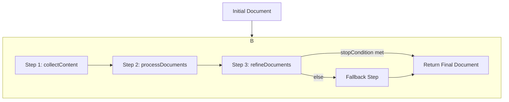

# Pipeline Module Developer Guide

The Pipeline module provides a powerful and flexible way to orchestrate complex, multi-step data processing workflows. It allows you to define a sequence of operations as independent, reusable "steps" and then execute them in order on a given data object, or "document".

This is particularly useful for tasks that involve multiple transformations, external API calls (like to an LLM), and conditional logic.

## Step-by-Step Data Transformation Visual Flow



## Core Concepts

- **Pipeline**: An object that manages a sequence of processing steps. It's responsible for executing each step in order and passing the transformed document from one step to the next.
- **Document**: The data object that flows through the pipeline. It can be of any type, which is defined when the pipeline is created. As it passes through each step, it can be modified or enriched.
- **Step (`PipelineStep<T>`)**: A single unit of work in the pipeline. It's a higher-order function that takes a `logger` and returns an `async` function to transform the document. This design allows steps to be self-contained and log their own operations.

---

## API Reference & Usage

### `pipeline<T>(logger)`

This is the factory function used to create a new pipeline instance.

- **`T`**: A generic type parameter representing the type of the document that will flow through the pipeline.
- **`logger`**: An instance of a logger (conforming to the `ILogger` interface) that will be passed to each step.

**Example:**

```typescript
import { pipeline } from "@/core/pipeline";
import { Logger } from "@/core/logger";
import type { QuestionsDoc } from "@/types"; // Your custom document type

const logger = new Logger();

// Create a pipeline that processes an array of `QuestionsDoc`
const myPipeline = pipeline<QuestionsDoc[]>(logger);
```

### `addStep(step)`

This method adds a single, atomic step to the pipeline's execution sequence.

- **`step`**: A `PipelineStep<T>` function.

**Example:**

A step that collects initial data and adds it to the document.

```typescript
import type { PipelineStep } from "@/core/pipeline";
import type { QuestionsDoc } from "@/types";

// This step loads questions from a file and initializes the document.
const collectQuestionsStep: PipelineStep<QuestionsDoc[]> = 
  (logger) => async (doc) => {
    logger.info("Collecting questions...");
    const questions = await loadQuestionsFromFile("path/to/questions.jsonl");
    // The document is an array, so we add the new data to it.
    return [...doc, ...questions];
  };

myPipeline.addStep(collectQuestionsStep);
```

### `addMultiStrategyStep(subSteps, stopCondition?)`

This method adds a complex step composed of multiple, sequential sub-steps. It's ideal for breaking down a large operation into smaller, more manageable parts.

- **`subSteps`**: An array of `PipelineStep<T>` functions that are executed in order.
- **`stopCondition`** (optional): A function `(doc: T) => boolean` that is checked after each sub-step. If it returns `true`, the execution of the remaining sub-steps is halted, and the pipeline proceeds to the next main step.

**Example:**

A multi-strategy step for processing a document.

```typescript
import { processContent, refineQuestions } from "./steps"; // Your sub-step implementations

// A stop condition that checks if enough high-quality questions have been generated.
const hasEnoughQuestions = (doc: QuestionsDoc[]): boolean => {
  const questionCount = doc.reduce((acc, d) => acc + d.questions.length, 0);
  return questionCount >= 100;
};

myPipeline.addMultiStrategyStep(
  [
    processContent(llmService),   // Sub-step 1: Generate initial questions
    refineQuestions(llmService),  // Sub-step 2: Refine and improve questions
  ],
  hasEnoughQuestions // Optional: Stop early if we have enough questions
);
```

### `run(initialDoc)`

This method starts the execution of the pipeline.

- **`initialDoc`**: The initial state of the document of type `T` that will be passed to the first step.

**Example:**

```typescript
async function main() {
  const initialDocument: QuestionsDoc[] = [];
  
  const finalDocument = await myPipeline.run(initialDocument);
  
  console.log("Pipeline execution complete!");
  console.log("Final document:", finalDocument);
}

main();
```

---

## Practical Example: Building a Question Generation Pipeline

Here’s how you can use the pipeline module to build the question generation workflow seen in this project.

**1. Define the Document Type**

First, define the shape of the data that will flow through your pipeline.

```typescript
// src/types/questions.ts
export interface Question {
  id: string;
  question: string;
  answer?: string;
}

export interface QuestionsDoc {
  source: string;
  content: string;
  questions: Question[];
}
```

**2. Create the Pipeline Instance**

Instantiate the pipeline with the document type.

```typescript
// src/features/question-generation/controller.ts
import { pipeline } from "@/core/pipeline";
import { Logger } from "@/core/logger";
import type { QuestionsDoc } from "@/types/questions";

const logger = new Logger();
const questionPipeline = pipeline<QuestionsDoc[]>(logger);
```

**3. Define and Add Steps**

Create each processing step as a self-contained function and add it to the pipeline.

```typescript
// src/features/question-generation/steps.ts
import type { PipelineStep } from "@/core/pipeline";
import type { QuestionsDoc } from "@/types/questions";

export const collectContent: PipelineStep<QuestionsDoc[]> = (logger) => async (doc) => {
  logger.info("Collecting content from sources...");
  // Logic to find and read files...
  const sources = [{ source: "file.md", content: "...", questions: [] }];
  return [...doc, ...sources];
};

export const processDocuments: PipelineStep<QuestionsDoc[]> = (logger) => async (doc) => {
  logger.info("Processing documents to generate questions...");
  // Logic to call an LLM for each document...
  return doc.map(d => ({ ...d, questions: [{ id: "q1", question: "New question?" }] }));
};

// src/features/question-generation/controller.ts
questionPipeline
  .addStep(collectContent)
  .addStep(processDocuments);
```

**4. Run the Pipeline**

Execute the pipeline with an empty initial document.

```typescript
// src/features/question-generation/controller.ts
async function generate() {
  const finalResult = await questionPipeline.run([]);
  // Logic to save the final result...
  console.log(finalResult);
}

generate();
```